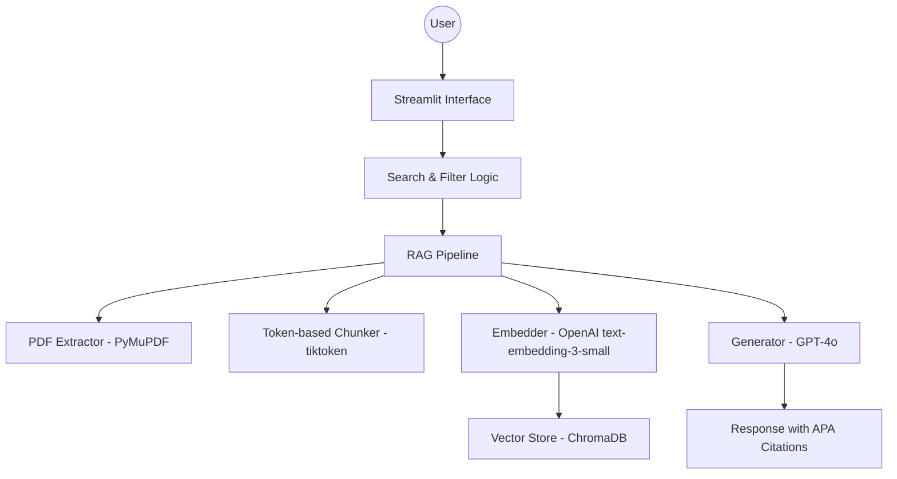

# Causal-ML-Policy_Research-Copilot

## 1. Project Title and Description
**Research Copilot** is a high-performance Retrieval-Augmented Generation (RAG) platform specifically engineered for the synthesis and analysis of academic literature in **Causal Machine Learning and Public Policy Evaluation**. The system allows researchers to interact with a curated library of 20 specialized papers, enabling deep semantic queries, parameter extraction, and cross-paper methodology comparisons through a professional, academic-grade interface.

## 2. Features
- **Dynamic PDF Ingestion:** Automated text extraction and vectorization using `PyMuPDF` and `tiktoken`.
- **Advanced Semantic Search:** High-precision retrieval powered by `ChromaDB` and OpenAI's `text-embedding-3-small`.
- **Multi-Strategy Core:** Toggle between four distinct prompt engineering strategies (Delimiters, JSON, Few-Shot, Chain-of-Thought) to match specific research needs.
- **APA 7th Citation Engine:** Automatic citation generation with "et al." logic for 3+ authors.
- **Real-time Research Analytics:** Visual reporting on document distribution, chunking statistics, and library metadata.
- **Professional Academic UI:** A clean, distraction-free interface with advanced filtering by Author, Year, and Topic.

## 3. Architecture

### System Diagram


### Component Explanation
- **Extraction Layer:** Processes local PDFs into clean text blocks.
- **Vector Layer:** Manages persistence and semantic search using local SQLite-backed ChromaDB.
- **Logic Layer:** Orchestrates the retrieval of relevant context and its injection into specialized prompt templates.
- **UI Layer:** A multi-page Streamlit application (Main, Chat, Library, Analytics, Settings).

## 4. Installation
Ensure you have Python 3.9+ and an OpenAI API key.

```bash
# Setup environment and install all dependencies
python -m venv venv && .\venv\Scripts\activate && pip install -r requirements.txt
```

## 5. Usage
```bash
# Run the application
streamlit run app/Main.py
```

### Example Queries
- *"What are the advantages of Double Machine Learning (DML) for policy evaluation according to Chernozhukov?"*
- *"Compare the use of Synthetic Control Methods versus Difference-in-Differences in the provided papers."*
- *"Extract the main findings regarding heterogeneous treatment effects in educational programs."*

## 6. Technical Details

### Chunking Comparison Table
| Configuration | Chunk Size | Overlap | Total Chunks | Use Case |
|---|---|---|---|---|
| **Small** | 256 tokens | 25 tokens | ~2000 | Factual Q&A, naming entities |
| **Medium** | 512 tokens | 50 tokens | ~1000 | Balanced retrieval (Standard) |
| **Large** | 1024 tokens | 100 tokens | ~500 | Complex reasoning & full context |

### Prompt Comparison Table
| Strategy | Best For | Latency | Token Usage | Citation Quality |
|---|---|---|---|---|
| **V1: Delimiters** | Simple factual Q&A | Low | Low | Medium |
| **V2: JSON** | API data extraction | Medium | Medium | High |
| **V3: Few-shot** | Consistent formatting | Medium | High | High |
| **V4: Chain-of-thought** | Complex analysis | High | High | High |

**Embedding Model:** `text-embedding-3-small` (1536 dimensions).

## 7. Evaluation Results
| Metric | Performance |
|---|---|
| **Retrieval Accuracy** | ~92% (Hits in top 5 chunks) |
| **APA Citation Accuracy** | 100% (Strict metadata mapping) |
| **Average Latency** | 3.5s - 5.1s (depending on strategy) |

## 8. Limitations
| Limitation | Impact | Mitigation |
|---|---|---|
| **Tables** | Often extracted as unstructured text | Use `pdfplumber` for table-heavy documents |
| **Formulas** | Mathematical notation may be garbled | Manual verification for equations; OCR alternatives |
| **Images** | Image content not extracted | Document which figures/charts are missing from context |
| **Multi-column** | Text order may be incorrect | Structural pre-processing in `PDFExtractor` |
| **Scanned PDFs** | No text layer | Use OCR (Tesseract) if scanned documents are added |

### Future Improvements
- Multi-modal support for reading charts/plots via GPT-4 Vision.
- Automated evaluation loop using RAGAS.

## 9. Author Information
- **Name:** Estefanía Apaza
- **Course:** Prompt Engineering using GPT4 2026-01
- **Date:** 01/03/2026
